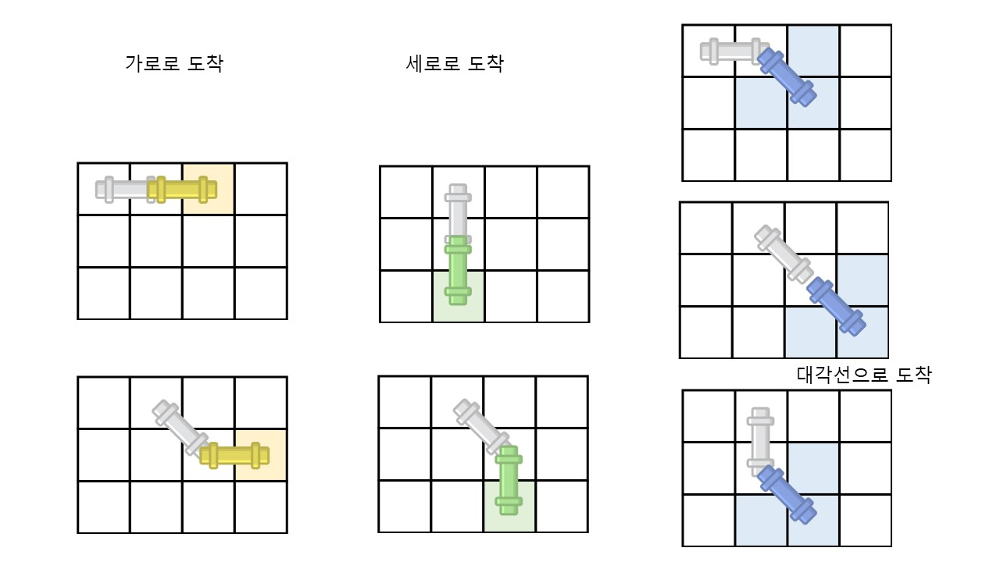

# 17070번 dp 풀이법
###### dp로 풀 때 도저히 어떻게 푸는지 몰라서 https://www.acmicpc.net/board/view/34823 를 참고했다.
```
처음에 bfs로 풀었는데 시간 초과가 났다.  
알고보니 bfs가 아니라 그냥 브루트 포스로 풀었다.  
그냥 큐를 사용한 전체탐색이다.  
bfs는 한번 방문했던 정점을 가지 않는 것이 특징인데 이 문제를 풀려면 dp를 쓰지 않는 이상 방문했던 정점을 다시 가야한다.  
따라서 bfs를 쓸 수 없고, bfs 방법을 이용해서 전체 탐색을 할 수 있다.  
``` 
```python
import sys
input = sys.stdin.readline
N = int(input())
graph = []
for _ in range(N):
    graph.append(list(map(int, input().split())))
dp1 = [[0 for _ in range(N)] for _ in range(N)]
dp2 = [[0 for _ in range(N)] for _ in range(N)]
dp3 = [[0 for _ in range(N)] for _ in range(N)]
dp1[0][1] = 1
for i in range(N):
    for j in range(2, N):
        if graph[i][j] != 1:
            # 가로
            if 0 <= j - 1 < N:
                dp1[i][j] += dp1[i][j-1]
                dp1[i][j] += dp3[i][j-1]
            # 세로
            if 0 <= i - 1 < N:
                dp2[i][j] += dp2[i-1][j]
                dp2[i][j] += dp3[i - 1][j]
            # 대각
            if 0 <= i - 1 < N and 0 <= j - 1 < N and graph[i-1][j] == 0 and graph[i][j-1] == 0:
                dp3[i][j] += dp1[i-1][j-1]
                dp3[i][j] += dp2[i-1][j-1]
                dp3[i][j] += dp3[i-1][j-1]
print(dp1[-1][-1] + dp2[-1][-1] + dp3[-1][-1])
```
## 풀이법
일단 임의의 (i, j) 좌표에 파이프의 마지막 부분이 닿았을 때 파이프의 형태는 가로, 세로, 대각선으로 세 가지이다.  
따라서 (N - 1, N - 1) 좌표에 파이프의 마지막 부분이 닿을 수 있는 경우의 수를 다 더해주면 정답을 구할 수 있다.    

-> 가로 + 세로 + 대각선    
1. 가로로 도착  
  1.가로 to 가로  
  2.대각선 to 가로  
2. 세로로 도착  
  1.세로 to 세로  
  2.대각선 to 세로  
3. 대각선으로 도착  
  1.가로 to 대각선  
  2.대각선 to 대각선
  3.세로 to 대각선  


그리고 N * N 크기의 집이 있을 때 아래와 같이 X로 표시된 부분은 파이프의 마지막 부분이 절대 놓일 수 없다.     
 | 
---|---|  

또, (0, 1) 은 처음 파이프가 가로로 놓여있으니 (0,1)에 갈 수 있는 방법은 가로 1가지, 세로 0가지, 대각선 0가지, 1 + 0 + 0가지이다.   
1.초기 세팅(0, 1)  
 |  | |
---|---|---|---|
가로|세로|대각|합|  

2.(0, 2)  
 |  |  | 
---|---|---|---|
가로|세로|대각|합|  

3.(N-1, N-1)
| | | 
---|---|---|---|
가로|세로|대각|합|  

(3, 3) 까지의 경우의 수를 구해보자.
1. 가로로 도착하는 경우
  1.가로 to 가로  
  ->(3,2)의 가로 표에서 0    
  2.대각선 to 가로  
  ->(3,2)의 대각선 표에서 0    
  따라서 0 + 0 = 0가지 경우이므로 가로 표 (3,3) = 0
2. 세로로 도착하는 경우
  1.세로 to 세로  
  ->(2,3)의 세로 표에서 1  
  2.대각선 to 세로  
  ->(2,3)의 대각선 표에서 1  
  따라서 1 + 1 = 2가지 경우이므로 세로 표 (3,3) = 2  
3. 대각선으로 도착하는 경우
  1.가로 to 대각선  
  ->(2,2)의 가로 표에서 0
  2.대각선 to 대각선 0  
  ->(2,2)의 대각선 표에서 0 
  3.세로 to 대각선  
  ->(2,2)의 세로 표에서 1
  따라서 0 + 0 + 1이므로 대각선 표 (3,3) = 1
따라서 합 표 (3,3) = 0 + 2 + 1 = 3이다  


